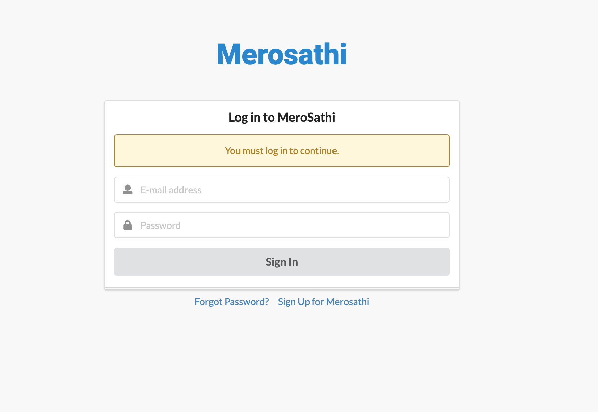
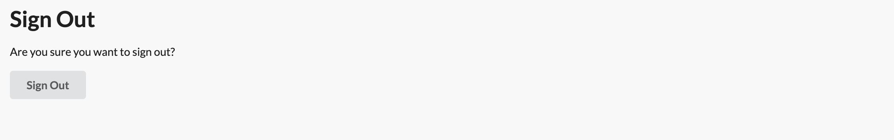

<h1 align="center">Merosathi</h1>

[View the live project here](https://pp4-merosathi.herokuapp.com/)

Merosathi is a platform for its user to connected with other user and build a social network.

User can create their own profile and post the pictures as well as posts. They can also search for other user who are using the merosathi network. User can also view profile of other user, can send friend request to connect to other user as well as receive friend request from other user to connect with them.

User can edit or delete the posts as well as picture which they posted. User can like or comment on the post or picture that are posted by other user but they can't edit/delete the post created by other user.

## Index – Table of Contents
* [User Experience (UX)](#user-experience-ux) 
* [Features](#features)
* [Design](#design)
* [Planning](#planning)
* [Technologies Used](#technologies-used)
* [Testing](#testing)
* [Deployment](#deployment)
* [Credits](#credits)

## User Experience (UX)

### User stories :

* USER STORY: Account Registration
  - As a **Site User** I can **Register and account** so that **I can make my profile**
* USER STORY: Like / Unlike
  - As a **Site User** I can **like or unlike** a post so that I can **interact with the other user's post**
* USER STORY: Comment on a post
  - As a **Site User** I can **leave comments on a post** so that I can be **involved in the conversation**
* USER STORY: View comments
  - As a **Site User** I can **view comments on an individual post** so that **I can read the conversation**
* USER STORY: Open a post 
  - As a **Site User** I can **publish on a post** so that **other user can see it**
* USER STORY: Send/Receive Friend Request 
  - As a **Site User** I can **send or receive friends request** so that i can be **friends with other user**
* USER STORY: View other user profile
  - As a **Site User** I can **view profile of other user** so I can **check their detail**
* USER STORY: Update Profile Info
  - As a **Site User** I can **Update my profile info** so I can **keep my account up-to-date**
* USER STORY: Edit / Delete Post
  - As a **Site User** I can **Edit / Delete my post** so I can **change post content or remove post**
* USER STORY: View Like/s
  - As a **Site User** I can **view the number of likes on each post** so that I can **see which are most popular**
* USER STORY: Search User my their first/last Name
  - As a **Site User** I can **search other user my their first/last name** so that I can **view their profile and add them as friend**
* USER STORY: Accept / Reject Friend Request
  - As a **Site User** I can **Accept / Reject Friend Request** so that I can **decide who i can be friends with**
* USER STORY: Withdraw Friend Request sent
  - As a **Site User** I can **withdraw friend request that I send** so that I can **change my mind to add other user as friends**
* USER STORY: Remove Friend
  - As a **Site User** I can **Remove Friend** so that I can **Unfriend other user who are already friend with me**

## Features

### Existing Features

-   __F1 User authentication__
    
    The application provides the following user authentication related functions :

    - User Registration
      - A user needs to be registered before they can sign in.  The option to Register appears on the sign in page. To Register, the user needs to provide a) a email address which has not already been registered, b) an username which should also be unique. And c) a password which they must enter twice.  Once registered a user can sign in.

        

    - User Sign in
      - Once registered a user can sign in and will have access to extra functionality, namely :
        - can post
        - can edit or delete their own post.
        - can like a post from other user.
        - can comment on other user post.

      - To sign in the user must provide a) a registered email-id and b) the password for the email-id
     
        
      
    - User Sign out
      - A signed in user can sign out by clicking on the logout button on the navigation bar.  The user simply needs to confirm the action by clicking on the Sign out button on the page.

        

-   __F02 Navigation Bar__
    
    Navigation Bar only appear once the user have signed in using their registered email address and password. User will have a multiple link to go to post page, their own profile page, search for other user by their first / last name, view all profile, view friends request received as well as view friend request send to other user and Logout button to logout of their account.  
    
    
    <!--  Image to be inserted -->

-   __F03 Publish a Post__
    
    Once registered and logged in into their account, user can publish the post with picture on their profile. The post will be available for other user to view. Other user can like/unlike post as well as comment on the post. User will have option to edit as well as delete their post.

    

-   __F04 Like a Post__
    
    In order to like a post a user must be signed in.  A post can be liked on post page.  The user simply needs to click on the like/heart icon to toggle between like/unlike.

    

-   __F05 Edit/Delete a Post__
    
    Once logged into their account, user will have option to edit or delete the post that they have published previously.

    
    
-   __F06 Search for other User__
    
    Once logged into their account, user will have option to search for the other user by their first or last name. User simply have to type the first or last name of other user that they want to search and click on search button or hit enter. Result of all matching profile will be displayed on the Result page.

    
    

-   __F07 View all User Profile__
    
    Once logged into their account, user will have option to view profile of all other user on the network who are not yet friend with user or have send/received the friend request. User will have an option to send friend request as well.

    

-   __F08 View all Friend Request Send__
    
    Once logged into their account, user will have option to view all the friend request that logged in user have send to other user. When in the page, user also will have option to cancel the friend request if they decided that they no longer want to send a request.

    

-   __F09 View all Friend Request Received__
    
    Once logged into their account, user will have option to view all the friend request that logged in user have received from other user. When in the page, user also will have option to reject the friend request if they decided that they don't want to be a friend with the user that send a request.

    

-   __F10 View all Post__
    
    Once logged into their account, user will have option to view all the post that current logged in user as well as other user have posted in network. In this page, user can like and comment in other user's post where as can also edit and delete their own post.

    

-   __F11 On-screen messages__
    
    To enhance usability of the application, user messages appear on-screen to confirm when certain actions have happened or report on problems.  For successful operations, a message will appear at the top of the screen and then fade-out/slide-up after 5 seconds.  For problems logging in, messages will appear in red text on-screen and stay until a user attempts the operation again.

    

### Features which could be implemented in the future

-   __Improve modal dialog to confirm deletion and Sign Out__
    
    The dialog to ask the user to confirm that they want to delete a post as well as they want to sign out of their account is very basic and could be improved have a format consistent with the application.

-   __Option to Like/Unlike comment posted in post__
    
    Current user can only like / unlike the post but this feature will give option to user to like / unlike the comments that user get in the post. 

-   __Option to Edit / Delete the comment that user commented on other user post__
    
    Currently, once user post the comment in post, they can not update or delete the comment. This feature will give option to user to edit / delete their post if they posted it by mistake.

-   __Option to send / receive message between users of the network__
    
    Currenlty, user can only post, like / unlike and comment in the network. This feature will give option to user to message other user who are already friends with them.

-   __Option to chat with other user in realtime__
    
    Currenlty, there is no option for users to communicate with their friends. This feature will give an ability to user to chat with other users who is friends with them.

## Design

-   ### Wireframes

    The wireframe diagrams below describe the Sign in, Sign up, Forget password, Posts, User Profile, Add Friends, Accept Friend Request, All Profile and Sign out.

    

    
Desktop Wireframes

    
    
    

## Planning

A GitHub Project with linked Issues was used as the Agile tool for this project.  User Stories with acceptance criteria were defined using GitHub Issues and development of code for these stories was managed using a Kanban board.  All of the User Stories were linked to a 'parent' Epic issue to show how they all supported the over-arching goal of the project.  The acceptance criteria were tested as each story moved to 'Done' and were also included in the final pre-submission manual testing documented in the Testing section of this README.

The Epic, User Stories and Kanban board can be accessed here : [Wayfarers Agile Tool](https://github.com/nofursad/pp4-merosathi/projects/1)

## Technologies Used

### Languages Used

-   [HTML5](https://en.wikipedia.org/wiki/HTML5)
-   [CSS3](https://en.wikipedia.org/wiki/Cascading_Style_Sheets)
-   [Jquery](https://jquery.com/)
-   [Python](https://www.python.org/)

### Frameworks, Libraries & Programs Used

-   [Google Fonts:](https://fonts.google.com/) used for the Lato font
-   [Font Awesome:](https://fontawesome.com/) was used to add icons for aesthetic and UX purposes.
-   [Git:](https://git-scm.com/) was used for version control by utilising the Gitpod terminal to commit to Git and Push to GitHub.
-   [GitHub:](https://github.com/) is used as the respository for the project code after being pushed from Git. In addition, for this project GitHub was used for the agile development aspect through the use of User Stories (GitHub Issues) and tracking them on a Kanban board.
-   [Balsamiq:](https://balsamiq.com/) was used to create the wireframes during the design process.
-   [Django](https://www.djangoproject.com/) was used as the framework to support rapid and secure development of the application
-   [Sementic UI](https://semantic-ui.com/) was used to build responsive web pages
-   [Gunicorn](https://gunicorn.org/) was used as the Web Server to run Django on Heroku
-   [dj_database_url](https://pypi.org/project/dj-database-url/) library used to allow database urls to connect to the postgres db
-   [psycopg2](https://pypi.org/project/psycopg2/) database adapter used to support the connection to the postgres db
-   [Cloudinary](https://cloudinary.com/) used to store the images used by the application
-   [Django allauth](https://django-allauth.readthedocs.io/en/latest/index.html) used for account registration and authentication
-   [jquery library](https://ajax.googleapis.com/ajax/libs/jquery/1.12.4/jquery.min.js) used to fade out alert messages
-   [Django testing tools](https://docs.djangoproject.com/en/3.2/topics/testing/tools/) used for python mvt testing
-   [Jest](https://jestjs.io/) - used to test jquery in script.js
-   [coverage](https://coverage.readthedocs.io/en/coverage-5.5/) used to check how much of the python code has been covered by automated tests

## Testing

### Validator Testing 

- [HTML Validator](https://validator.w3.org/)

    - As this project uses Django templates the html has been validated by manually clicking through the application pages, copying the source of the rendered pages and then validating this version of the html using the W3C Validator (link shown above).  HTML  for the Django admin site pages was not edited so has not been validated here.  The Signup, Login and Logout pages from Django allauth were customized and so have been validated, with results below.

- [Javascript Validator](https://jshint.com/)

  

- [Python Validator](http://pep8online.com/)
  

### Automated Testing

  

### Browser Compatibility

- Chrome DevTools was used to test the responsiveness of the application on different screen sizes.  In addition, testing has been carried out on the following browsers :
    - Google Chrome version 9.0.4606.81 (64-bit)
    - Firefox version 93.0 (64-bit)
    - Microsoft Edge 94.0.992.38 (64-bit)
 
    
### Known bugs

- Currently no known bugs.

## Deployment

Detailed below are instructions on how to clone this project repository and the steps to configure and deploy the application.  Code Institute also provides a summary of similar process steps here : [CI Cheat Sheet](https://codeinstitute.s3.amazonaws.com/fst/Django%20Blog%20Cheat%20Sheet%20v1.pdf)

1. How to Clone the Repository
2. Create Application and Postgres DB on Heroku
3. Configure Cloudinary to host images used by the application
4. Connect the Heroku app to the GitHub repository
5. Executing automated tests
6. Final Deployment steps

### How to Clone the Repository 

- Go to the https://github.com/nofursad/pp4-merosathi repository on GitHub 
- Click the "Code" button to the right of the screen, click HTTPs and copy the link there
- Open a GitBash terminal and navigate to the directory where you want to locate the clone
- On the command line, type "git clone" then paste in the copied url and press the Enter key to begin the clone process
- To install the packages required by the application use the command : pip install -r requirements.txt
- When developing and running the application locally set DEBUG=True in the settings.py file
- Changes made to the local clone can be pushed back to the repository using the following commands :

  - git add *filenames*  (or "." to add all changed files)
  - git commit -m *"text message describing changes"*
  - git push

- N.B. Any changes pushed to the master branch will take effect on the live project once the application is re-deployed from Heroku

### Create Application and Postgres DB on Heroku
- Log in to Heroku at https://heroku.com - create an account if needed.
- From the Heroku dashboard, click the Create new app button.  For a new account an icon will be visible on screen to allow you to Create an app, otherwise a link to this function is located under the New dropdown menu at the top right of the screen.
- On the Create New App page, enter a unique name for the application and select region.  Then click Create app.
- On the Application Configuration page for the new app, click on the Resources tab.
- In the Add-ons search bar enter "Postgres" and select "Heroku Postgres" from the list - click the "Submit Order Form" button on the pop-up dialog.
- Next, click on Settings on the Application Configuration page and click on the "Reveal Config Vars" button - check the DATABASE_URL has been automatically set up. 
- Add a new Config Var called DISABLE_COLLECTSTATIC and assign it a value of 1.
- Add a new Config Var called SECRET_KEY and assign it a value - any random string of letters, digits and symbols.
- The settings.py file should be updated to use the DATABASE_URL and SECRET_KEY environment variable values as follows :

  - DATABASES = {'default': dj_database_url.parse(os.environ.get('DATABASE_URL'))}

  - SECRET_KEY = os.environ.get('SECRET_KEY')

- In Gitpod, in the project terminal window, to initialize the data model in the postgres database, run the command : python3 manage.py migrate 
- Make sure the project requirements.txt file is up to date with all necessary supporting files by entering the command : pip3 freeze --local > requirements.txt
- Commit and push any local changes to GitHub.
- In order to be able to run the application on localhost, add SECRECT_KEY and DATABASE_URL and their values to env.py

### Configure Cloudinary to host images used by the application
- Log in to Cloudinary - create an account if needed.  To create the account provide your name, email and set up a password.  For "primary interest" you can choose "Programmable Media for image and video API".  Click "Create Account" and you will be sent an email to verify your account and bring you to the dashboard.
- From the dashboard, copy the "API Environment variable" value by clicking on the "Copy to clipboard" link.
- Log in to Heroku and go to the Application Configuration page for the application.  Click on Settings and click on the "Reveal Config Vars" button.
- Add a new Config Var called CLOUDINARY_URL and assign it the value copied from the Cloudinary dashboard, but remove the "CLOUDINARY_URL=" at the beginning of the string. 
- In order to be able to run the application on localhost, also add the CLOUDINARY_URL environment variable and value to env.py

### Connect the Heroku app to the GitHub repository
- Go to the Application Configuration page for the application on Heroku and click on the Deploy tab.
- Select GitHub as the Deployment Method and if prompted, confirm that you want to connect to GitHub. Enter the name of the github repository (the one used for this project is (https://github.com/nofursad/pp4-merosathi) and click on Connect to link up the Heroku app to the GitHub repository code.
- Scroll down the page and choose to either Automatically Deploy each time changes are pushed to GitHub, or Manually deploy - for this project Manual Deploy was selected.
- The application can be run from the Application Configuration page by clicking on the Open App button.
- The live link for this project is (https://pp4-merosathi.herokuapp.com/)

### Executing automated tests
- The existing automated jquery/javascript test can be executed using jest as follows :
  - If jest is not installed then run the command : npm install --save-dev jest
  - Run the js test file using the command : npm test

- The existing automated django/python tests are executed using unittest as follows :
  - Run the python tests using the command : python3 manage.py test
  - To run just a subset of the tests, then append the application and test file name to the command, e.g. : python3 manage.py test post.test_models

- Test coverage for the django/python tests can be reviewed using the coverage tool :
  - If coverage is not installed then run the command : pip3 install coverage
  - Execute the following series of commands to determine test coverage :
    - coverage run --source=post manage.py test
    - coverage report
    - coverage html
    - python3 -m http.server  (detailed results can be viewed via the browser in the htmlcov directory)

### Final Deployment steps
Once code changes have been completed and tested on localhost, the application can be prepared for Heroku deployment as follows :
- Set DEBUG flag to False in settings.py
- Ensure this line exists in settings.py to make summernote work on the deployed environment (CORS security feature): X_FRAME_OPTIONS = 'SAMEORIGIN'
- Ensure requirements.txt is up to date using the command : pip3 freeze --local > requirements.txt
- Push files to GitHub
- In the Heroku Config Vars for the application delete this environment variable :  DISABLE_COLLECTSTATIC
- On the Heroku dashboard go to the Deploy tab for the application and click on deploy branch

#### The live link to the application can be found here - [PP4 Merosathi](https://pp4-merosathi.herokuapp.com/) 

## Credits 

### Code 
- Much of the coding and testing relies heavily on information in the "Hello Django" and "I Think Therefore I Blog" walkthroughs in the Code Institue Full Stack Frameworks module. 
- Code on how to implement data model constraints was based on information found here : [Constraints](https://docs.djangoproject.com/en/3.2/ref/models/constraints/)
- Code to restrict data value range : [Min Max Values](https://stackoverflow.com/questions/65416042/max-and-min-values-for-a-django-model-field-according-to-the-values-already-int)
- Setting to turn off auth email verification : [EMAIL VERIFICATION](https://stackoverflow.com/questions/53968044/django-user-registration-error-with-django-rest-auth-package)
- Some ideas on how to format the authentication/Sign in/Registration pages came from : [Page layout demo](https://www.bootstrapdash.com/product/free-bootstrap-login/#product-demo-section)
- Code to 'bold' active navbar link : [Active Link](https://stackoverflow.com/questions/32931436/active-tag-on-bootstrap-with-django)
- Code to remove class from base.html : [Override class](https://stackoverflow.com/questions/34232936/dry-method-to-add-a-class-to-body-in-the-base-template)
- Code to help with order_by for composite foreign key : [Composite order](https://stackoverflow.com/questions/1474135/django-admin-ordering-of-foreignkey-and-manytomanyfield-relations-referencing-u)
- Code to help filter upcoming bookings : [Date handling](https://stackoverflow.com/questions/21576727/django-records-greater-than-particular-date)
- Code to build dropdown for schedule : [Drop-down control](https://stackoverflow.com/questions/57533058/django-how-to-add-items-to-bootstrap-dropdown)
- Code on how to build dropdown : [Additional Drop-down information](https://getbootstrap.com/docs/5.0/components/dropdowns/)
- Code on how to convert number string to list : [Python lists](https://stackoverflow.com/questions/4395230/building-a-list-in-django-templates)
- Code on how to display messages to user : [Alert messages](https://stackoverflow.com/questions/28240746/django-how-to-implement-alertpopup-message-after-complete-method-in-view)
- Additional code on alert message handling : [Fade and Slide](https://stackoverflow.com/questions/23101966/bootstrap-alert-auto-close)
- Code to test automatically generated dates : [Date Mocking](https://stackoverflow.com/questions/49874923/how-to-test-auto-now-add-in-django)
- Code on how to use setUpTestData : [Test Data generation](https://stackoverflow.com/questions/29428894/django-setuptestdata-vs-setup)
- Code on how to create a user reference and log them in : [Test User login](https://stackoverflow.com/questions/2619102/djangos-self-client-login-does-not-work-in-unit-tests)
- Code to help with naive date : [Timezone aware dates](https://stackoverflow.com/questions/4530069/how-do-i-get-a-value-of-datetime-today-in-python-that-is-timezone-aware)
- Code to help with testing admin.py customizations : [Custom Admin test](https://newbedev.com/testing-custom-admin-actions-in-django)
- Code on how to delay jest test : [Jest Delay](https://stackoverflow.com/questions/46077176/jest-settimeout-not-pausing-test)
- Code on how to stop jquery animations for jest testing : [De-activate animations](https://stackoverflow.com/questions/61295452/jest-test-jquery-fadein-fadeout-on-specific-elements)

### Media 
- The Lato font used was imported from [Google Fonts](https://fonts.google.com/)
- Fontawesome was used for icons, including icons for like, comments, user - [Font Awesome](https://fontawesome.com/)
- The applicaiton favicon was created from the "exchange" icon image on [Font Awesome](https://fontawesome.com/) 
  
  
### Acknowledgments

- Thank you to my mentor Brian Macharia for his continuing help and feedback. His advice and tips have been very beneficial, especially in the area of coding standards and best practice.